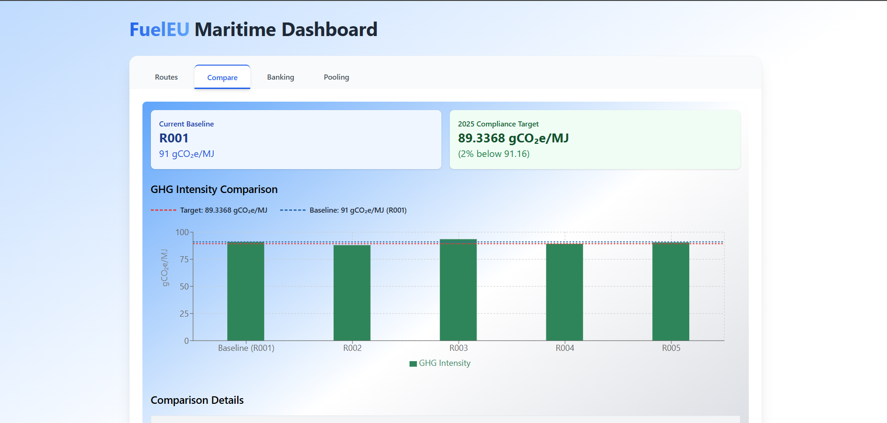
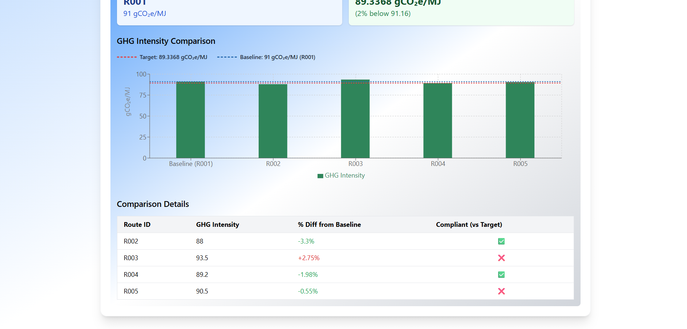
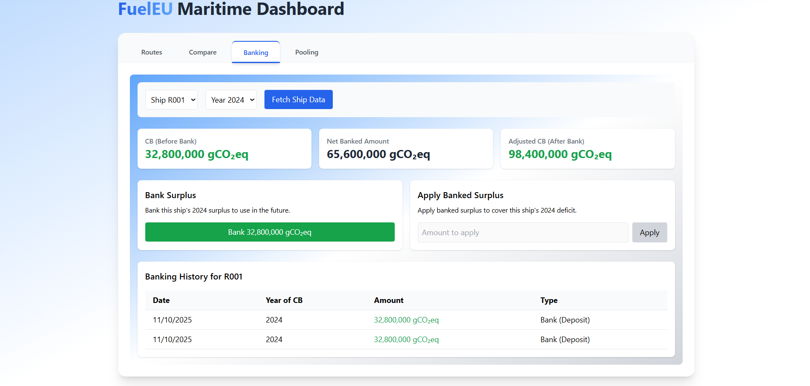
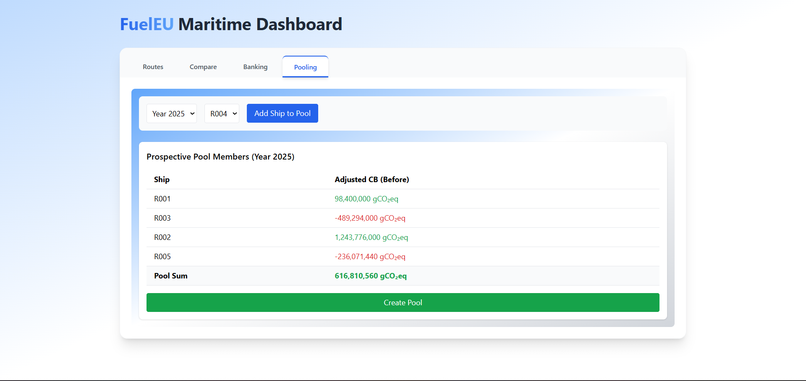

# FuelEU Maritime Compliance Platform

## Overview
A full-stack implementation of the FuelEU Maritime compliance dashboard, supporting route management, comparison, banking, and pooling per EU Regulation 2023/1805.

# FuelEU Maritime Compliance Platform

## Overview

A full-stack implementation of the FuelEU Maritime compliance dashboard, supporting route management, comparison, banking, and pooling per EU Regulation 2023/1805.

- **Frontend:** React + TypeScript + TailwindCSS
- **Backend:** Node.js + TypeScript + PostgreSQL
- **Architecture:** Hexagonal (Ports & Adapters / Clean Architecture)

## Architecture Summary

frontend/
  src/
    core/
      domain/
      application/
      ports/
    adapters/
      ui/
      infrastructure/
    shared/

backend/
  src/
    core/
      domain/
      application/
      ports/
    adapters/
      inbound/http/
      outbound/postgres/
    infrastructure/
      db/
      server/
    shared/

- **Core:** Domain models, business logic, and use-cases (no framework dependencies)
- **Adapters:** UI (React), API clients (axios), HTTP controllers, DB repositories
- **Infrastructure:** Express server, Prisma/Postgres DB

## Setup & Run Instructions

### Backend

```powershell
cd backend
npm install
# Set up PostgreSQL and update .env with DB credentials
npx prisma migrate dev --name init
npm run dev
```

### Frontend

```powershell
cd frontend
npm install
# If backend runs on a non-default port, set REACT_APP_API_URL in .env
npm start
```

## How to Execute Tests

### Backend

```powershell
npm run test
```

### Frontend

```powershell
npm test
```

## Screenshots


### Routes Tab


### Compare Tab



### Banking Tab


### Pooling Tab



## Sample Requests

**Set Baseline:**
```http
POST /routes/R001/baseline
```

**Get Comparison:**
```http
GET /routes/comparison
```

**Bank Surplus:**
```http
POST /banking/bank
```

**Create Pool:**
```http
POST /pools
```

## AI-Agent Usage
See `AGENT_WORKFLOW.md` for detailed logs, prompts, and validation steps.


